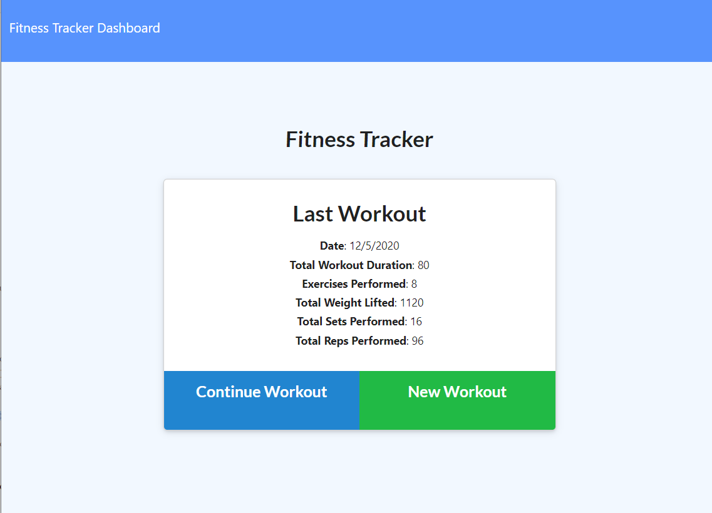
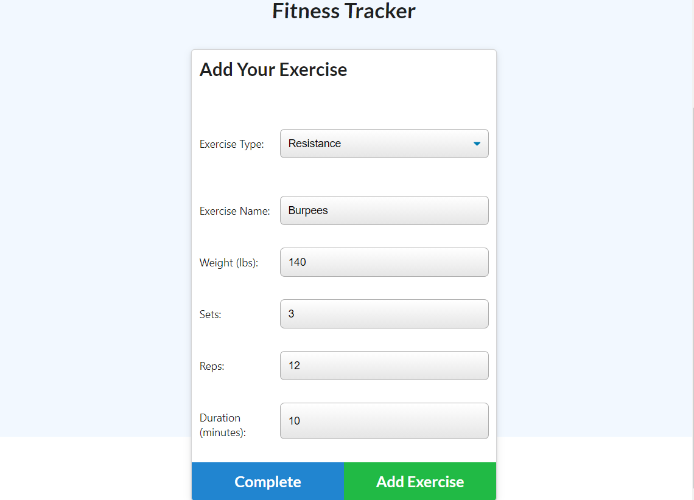
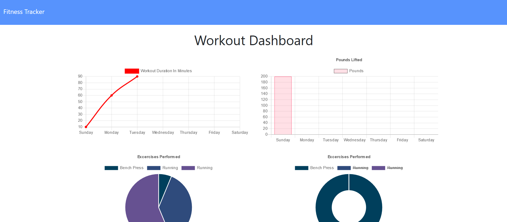

Workout Tracker

<!-- Live link to deployed app -->
Repository: https://github.com/Mdudzik92/mattsworkouttracker
Deployed app: https://mattsworkouttracker.herokuapp.com

<!-- Technologies used -->
Express, JavaScript, MongoDB, Mongoose

<!-- Explanation of what the app is -->
This is an app which allows the user to track their workout routines. They can start by clicking "New Workout" and filling out the details of their workout after deciding whether it will be a resistance workout or a cardio workout. Once the details are filled out they can add it and then either add another workout or hit "Complete" which takes them back to the main workout summary screen where the combined Total Workout Duration, Exercises Performed, Total Weight Lifted, Total Sets Performed, and Total Reps Performed are on display. The user can also visit their "Workout Dashboard" by clicking "Dashboard" on the top left corner of the app. This brings them to a page that contains detiled diagrams of their workout summary. 

<!-- Screenshot -->

<!-- License -->
MIT

<!-- Contact information -->
Email: mdudzik92@gmail.com